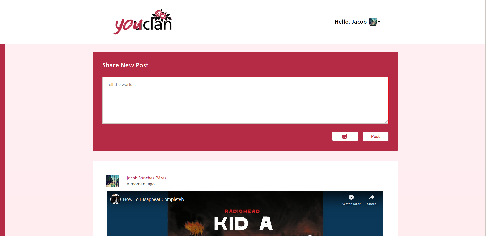
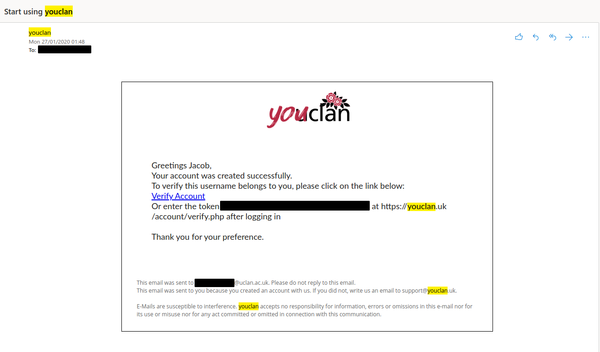
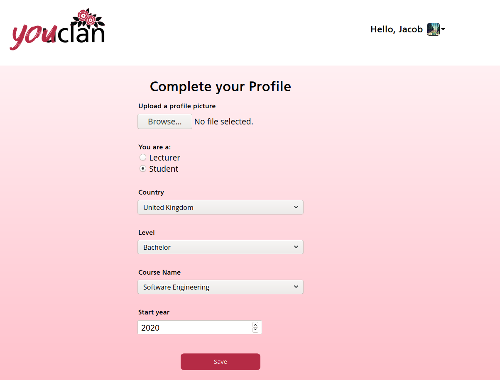
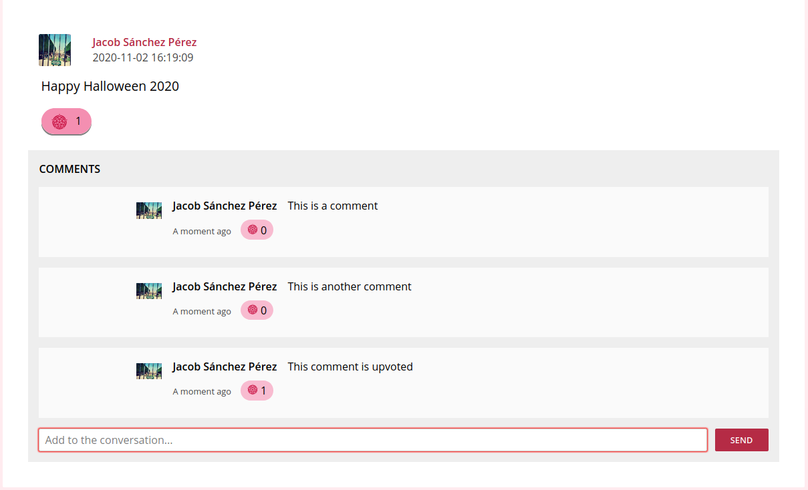
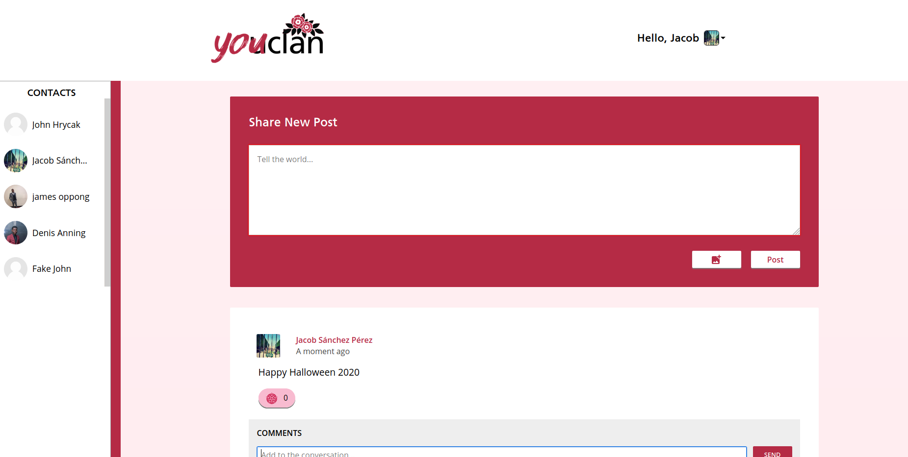
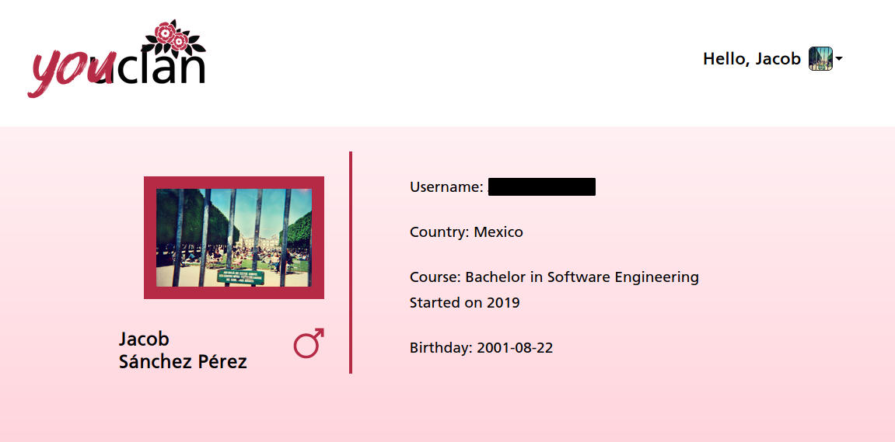

# youclan: A Social Network for UCLan Students





New students of the University of Central Lancashire may often face difficulties establishing connections with their peers, largely because of the lack of a common medium of communication. This is even more relevant today, now that the COVID-19 pandemic has reduced the physical presence of students to a minimum. A social media focused entirely on UCLan can help to connect students with similar interests, courses and outlooks.


### Registration





The way we tackle user registration and verification is simple: we take advantage of the existing university student account system. Users can register only using their university username. We then verify that by sending an e-mail to the corresponding university mail account. 


After verification, users must complete their profile with information about the degree they are undertaking, and optionally a profile picture.





### Interactivity





The main feature of *youclan* is the ability to create posts. Said posts are composed of some text and/or an image. Additionally, YouTube links are parsed and displayed in video form. Users are also able to comment under posts, and up-vote posts and comments. Our version of the like or up-vote is the Lancashire rose, which is part of UCLan's identity.


### Profiles





Due to time constraints a "friend" system could not be implemented. Ideally the left bar should show the user's friends/contacts. Currently it lists every user registered on the site.


After clicking on one of the profiles on the sidebar, or the user that made a post/comment, their profile page will be shown, along with their basic information.





## SETUP

These should give you a general idea of the steps to take in order to setup an instance of this website locally (for development or testing purposes)


#### DOCKER

Set the database credentials you wish to have at `setup/db_config`.

To start the website, at the root folder run:

```bash
docker-compose up
```

(by default available at `localhost:8001`)


Then, change the uploads folder permissions to allow PHP to write to it

```
docker exec -it youclan-php-apache bash -c "chown -R www-data:www-data /var/www/html/uploads/"
```


Most likely, PHP won't be able to send any email, thus you won't be able to verify your account. Instead, access the database directly, for example, with

```
docker exec -it youclan-mysql bash
mysql -u youclan_admin -p
```

And retrieve your token, located in `main_youclan_uk.users` (you will need to attempt to login after registration)


#### MANUAL SETUP

The site was designed with `PHP v7.4.5` and `MySQL v5.7` in mind.

To setup the database you can run the following inside a mysql CLI:

```bash
mysql> source setup/main_youclan_uk.sql
```

Then, modify [config.php](setup/config.php) (or set some environment vars) to include your database connection details and move it to the `/htdocs/database` folder.


---

##### **Made with the invaluable help of:**

- [Dennis Anning](https://www.linkedin.com/in/denis-anning-40b7b21a1/)

- [James Oppong](https://www.linkedin.com/in/james-mclean-oppong-356693175/)

 

